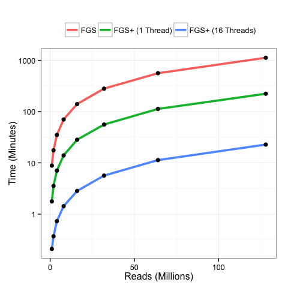
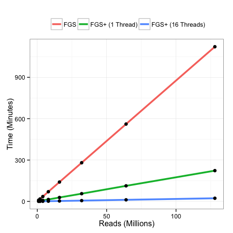

# FragGeneScan+ Results
Niels Hanson  
March 18, 2015  

# Preamble

* load some packages


```r
library(ggplot2)
library(reshape2)
```

# FragGeneScan+ Performance

* Modify and clean data set


```r
df <- read.table("fgsp_results.csv", header=T, sep=",")
names(df) <- c("reads_millions", "FGS", "FGS+ (1 Thread)", "FGS+ (16 Threads)")
df.m <- melt(df, id.var=("reads_millions"), variable.name="Algorithm", value.name = "time_min")
df.m$Algorithm <- factor(df.m$Algorithm, levels=c("FGS", "FGS+ (1 Thread)", "FGS+ (16 Threads)"))
```

* Plot completion time vs. number of sequences


```r
p1 <- ggplot(df.m, aes(x=reads_millions, y=time_min, group=Algorithm)) 
p1 <- p1 + geom_line(aes(color=Algorithm), size=1.3) 
p1 <- p1 + geom_point(size = 2.5) 
p1 <- p1 + scale_y_log10(breaks=c(1,10,100,1000))
p1 <- p1 + xlab("Reads (Millions)")
p1 <- p1 + ylab("Time (Minutes)")
p1 <- p1 + theme_bw()
p1 <- p1 + theme(legend.position="top", legend.title=element_blank())
p1 <- p1 + scale_fill_discrete( labels=c("Control", "Treatment 1", "Treatment 2"))
p1
```

 


```
## quartz_off_screen 
##                 2
```

* Do it again except without $log_{10}$


```r
p2 <- ggplot(df.m, aes(x=reads_millions, y=time_min, group=Algorithm)) 
p2 <- p2 + geom_line(aes(color=Algorithm), size=1.3) 
p2 <- p2 + geom_point(size = 2.5) 
p2 <- p2 + xlab("Reads (Millions)")
p2 <- p2 + ylab("Time (Minutes)")
p2 <- p2 + theme_bw()
p2 <- p2 + theme(legend.position="top", legend.title=element_blank())
p2 <- p2 + scale_fill_discrete( labels=c("Control", "Treatment 1", "Treatment 2"))
p2
```

 


```
## quartz_off_screen 
##                 2
```

* Calcualte speedup


```r
temp_df <- subset(x = df.m, reads_millions == 128)
speed_up <- round(temp_df[1, "time_min"] / temp_df[3, "time_min"], digits = 1)
```

* The coordinated thread implementation of FragGeneScan+ is 49.3 times faster than its original implementation.
